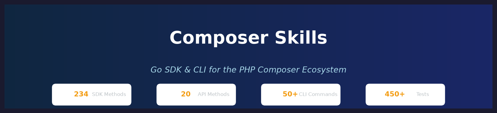
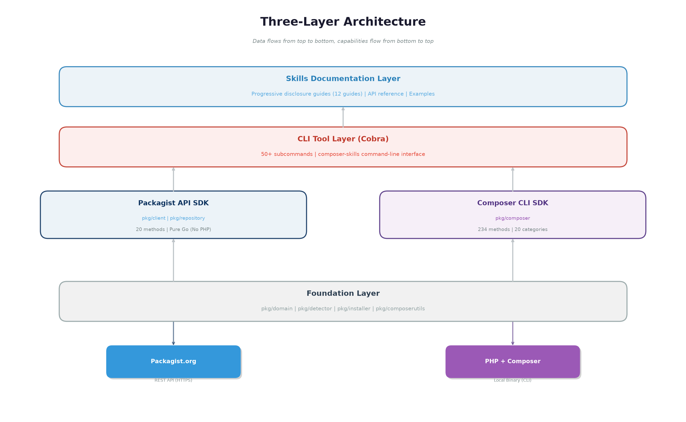
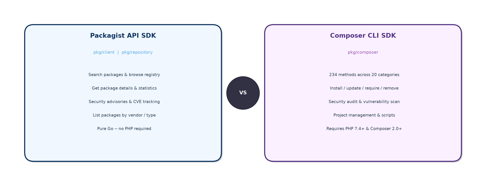
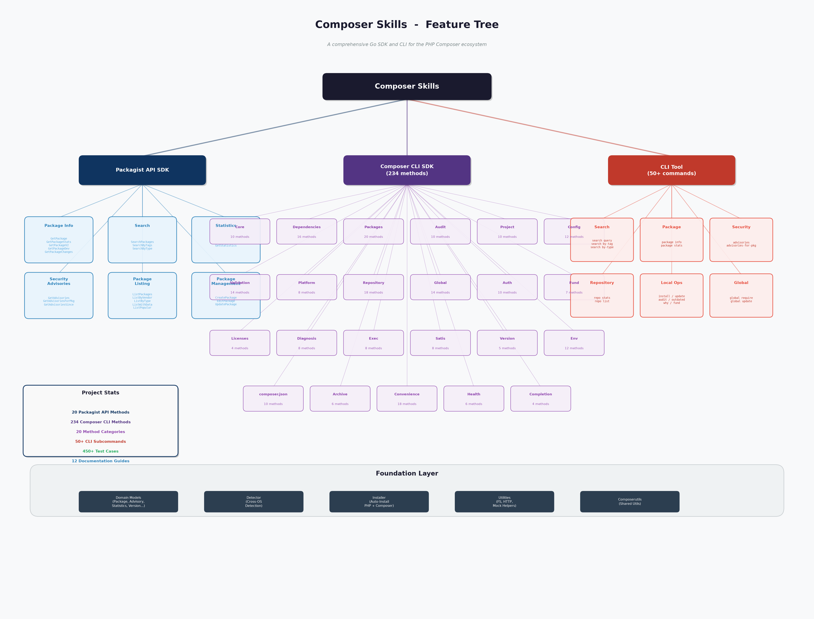
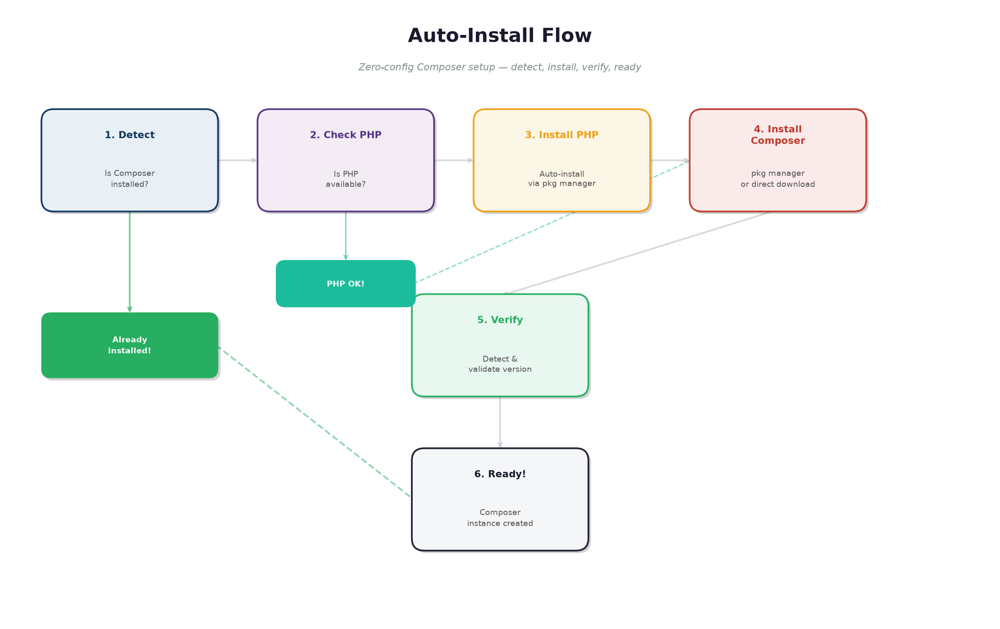
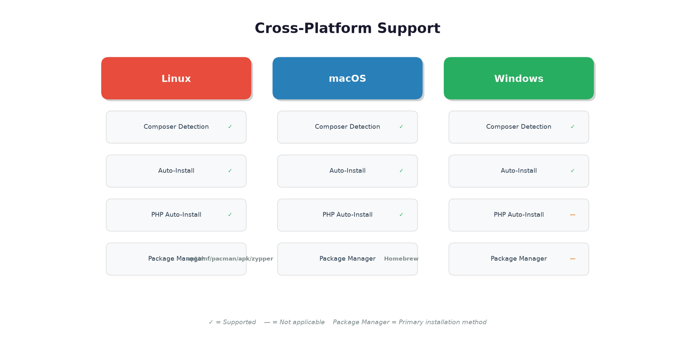
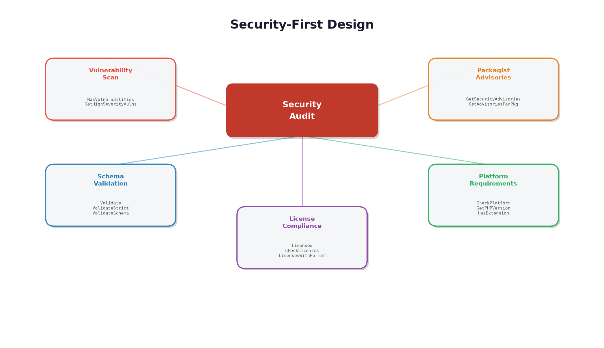

# Composer Skills

<p align="center">
  
</p>

[](https://pkg.go.dev/github.com/scagogogo/composer-skills)
[](https://goreportcard.com/report/github.com/scagogogo/composer-skills)
[](https://github.com/scagogogo/composer-skills/actions/workflows/go-tests.yml)
[](LICENSE)

**PHP Composer 生态缺失的 Go SDK** — 别再手动解析 `exec.Command` 的输出了。一个 import 就能获得类型化、经过测试的 API，覆盖 Packagist REST API 和所有 Composer CLI 命令，还自带零配置自动安装。

简体中文 | [English](README.md)

---

## 它解决了什么问题

如果你写 Go 代码，并且需要跟 PHP/Composer 打交道，你大概率写过这种代码：

```go
// 😩 老方法 — 脆弱、无类型、没有错误处理
out, _ := exec.Command("composer", "audit").Output()
lines := strings.Split(string(out), "\n")
// 然后你还得自己解析这些字符串...
```

Composer Skills 给你的是这样的：

```go
// 😊 新方法 — 类型化、经过测试、自动安装
result, _ := comp.AuditWithJSON()
fmt.Printf("漏洞数: %d\n", result.Found)
```

**你获得的能力：**

| 痛点 | 解决方案 |
|---|---|
| 手动解析 `exec.Command` 输出 | **234 个类型化 Go 方法**，返回结构化结果 |
| 手写 HTTP 请求访问 Packagist | **20 个类型化 API 方法**，直接返回 Go 结构体 |
| "这台机器装了 Composer 吗？" | **跨操作系统检测器**，到处都能找到 |
| "没装 Composer，怎么办？" | **自动安装器**，自动下载 Composer + PHP |
| 不同操作系统要写不同代码 | **智能默认配置**，按平台选择 brew、apt 或直接下载 |

> **一个 import，全部搞定：** `go get github.com/scagogogo/composer-skills`

---

## 架构

<p align="center">
  
</p>

| 层级 | 功能 | 包路径 |
|------|------|---------|
| **Skills 文档层** | 渐进式披露指南（12 个指南） | `docs/skills/` |
| **CLI 工具层** | 50+ 子命令（基于 Cobra） | `cmd/composer-skills/` |
| **Packagist API SDK** | HTTP 调用 Packagist（纯 Go） | `pkg/client`、`pkg/repository` |
| **Composer CLI SDK** | 执行本地 `composer` 二进制（234 方法） | `pkg/composer` |
| **基础层** | 领域模型、检测、安装、工具集 | `pkg/domain`、`pkg/detector`、`pkg/installer`、`pkg/composerutils` |

---

## 双 SDK 合一

<p align="center">
  
</p>

| | Packagist API SDK | Composer CLI SDK |
|---|---|---|
| **包路径** | `pkg/client`、`pkg/repository` | `pkg/composer` |
| **工作方式** | HTTP 调用 Packagist API | 执行本地 `composer` 二进制文件 |
| **需要 PHP？** | **不需要**（纯 Go） | 需要（PHP 7.4+ 和 Composer 2.0+） |
| **使用场景** | 搜索包、获取统计、安全公告 | 安装/更新依赖、管理项目、审计、运行脚本 |

---

## 功能树

<p align="center">
  
</p>

---

## 自动安装：零配置

<p align="center">
  
</p>

Composer Skills 处理整个安装链 — 检测 Composer → 检查 PHP → 缺失则自动安装 → 验证 → 就绪。默认选项已开启 `AutoInstall: true`，开箱即用：

```go
// 就这么简单。如果 Composer 不存在，会自动安装。
comp, err := composer.New(composer.DefaultOptions())
```

**平台支持：**

<p align="center">
  
</p>

---

## 安全优先

<p align="center">
  
</p>

```go
// 本地审计，结构化结果
result, _ := comp.AuditWithJSON()
if result.Found > 0 {
    for _, v := range result.Advisories {
        fmt.Printf("⚠ %s: %s (%s)\n", v.Package, v.Title, v.Severity)
    }
}

// 从 Packagist 获取远程安全公告
advisories, _ := client.GetSecurityAdvisories()

// 提交前验证 composer.json
result, _ := comp.ValidateStructured()
```

---

## ✨ 核心特性

- **完整 Composer CLI 覆盖** — 234 个 SDK 方法，20 个分类，封装所有标准 Composer 命令
- **Packagist API 客户端** — 20 个方法搜索、浏览和查询 PHP 包注册中心（纯 Go，无需 PHP）
- **安全优先** — 审计依赖、检查漏洞、验证 schema、检查平台要求
- **自动检测与安装** — 跨操作系统自动检测或安装 Composer（支持 PHP 自动安装）
- **跨平台** — 支持 Windows、macOS 和 Linux，智能默认配置
- **CLI 工具** — 50+ 子命令，从终端暴露所有 SDK 能力
- **结构化返回值** — 类型安全的返回值（AuditInfo、OutdatedInfo、VersionInfo 等），而非原始字符串
- **便捷方法** — `IsPackageInstalled`、`GetDirectDependencyNames`、`GetProjectSummary` 等 18+ 个辅助方法
- **渐进式文档** — 从 3 行快速入门到完整 API 参考（12 个指南）
- **测试完善** — 450+ 测试用例，基于 Mock 隔离

---

## 🚀 快速开始

### 安装

```bash
go get github.com/scagogogo/composer-skills
```

### Packagist API（无需 PHP）

```go
package main

import (
    "fmt"
    "time"
    "github.com/scagogogo/composer-skills/pkg/client"
)

func main() {
    c := client.NewComposerClient(30 * time.Second)

    // 搜索包
    results, _ := c.SearchPackages("logging", 10, 1)
    fmt.Printf("找到 %d 个包\n", results.Total)

    // 获取包详情
    pkg, _ := c.GetPackage("monolog/monolog")
    fmt.Printf("%s: %s\n", pkg.Package.Name, pkg.Package.Description)

    // 安全公告
    advisories, _ := c.GetSecurityAdvisories()
    fmt.Printf("%d 条安全公告\n", len(advisories.Advisories))

    // 统计信息
    stats, _ := c.GetStatistics()
    fmt.Printf("总包数: %d\n", stats.Packages)
}
```

### Composer CLI 封装（需要 PHP + Composer）

```go
package main

import (
    "fmt"
    "log"
    "github.com/scagogogo/composer-skills/pkg/composer"
)

func main() {
    comp, err := composer.New(composer.DefaultOptions())
    if err != nil {
        log.Fatal(err)
    }
    comp.SetWorkingDir("/path/to/php/project")

    // 依赖管理
    comp.Install(false, true)
    comp.RequirePackage("monolog/monolog", "^3.0", false)
    comp.Update([]string{}, false)

    // 安全审计（结构化结果）
    result, _ := comp.AuditWithJSON()
    fmt.Printf("发现漏洞: %d\n", result.Found)

    // 包检查
    output, _ := comp.ShowDependencyTree("symfony/console")
    output, _ = comp.WhyPackage("symfony/polyfill-mbstring")
    output, _ = comp.OutdatedPackages()

    // 平台检查
    phpVer, _ := comp.GetPHPVersion()
    hasExt, _ := comp.HasExtension("mbstring")

    // 认证与配置
    comp.AddGitHubToken("github.com", "your-token")
    config, _ := comp.GetAuthConfig()
}
```

### 自动安装 Composer

```go
package main

import (
    "fmt"
    "github.com/scagogogo/composer-skills/pkg/installer"
    "github.com/scagogogo/composer-skills/pkg/detector"
)

func main() {
    // 检测 Composer 是否已安装
    d := detector.NewDetector()
    if d.IsInstalled() {
        path, _ := d.Detect()
        fmt.Printf("Composer 已安装于: %s\n", path)
        return
    }

    // 自动安装（智能操作系统识别，还可自动安装 PHP）
    inst := installer.NewInstaller(installer.SmartConfig())
    if err := inst.Install(); err != nil {
        fmt.Printf("安装失败: %v\n", err)
    }
}
```

### 便捷方法

```go
// 组合多个操作的快捷辅助方法
isInstalled := comp.IsPackageInstalled("monolog/monolog")
isDev := comp.IsPackageDev("monolog/monolog")
deps := comp.GetDirectDependencyNames()
summary := comp.GetProjectSummary()
hasLock := comp.HasComposerLock()
hasVendor := comp.HasVendorDir()
abandoned := comp.GetAbandonedPackagesFromLock()
namespaces := comp.GetNamespaceMap()
scripts := comp.GetScripts()
```

### 命令行工具

```bash
# 构建
make build

# Packagist 操作（无需 PHP）
./bin/composer-skills search query "logging"
./bin/composer-skills package info symfony/console
./bin/composer-skills security advisories
./bin/composer-skills repo stats

# 本地 Composer 操作
./bin/composer-skills local install --working-dir /path/to/project
./bin/composer-skills local audit --working-dir /path/to/project
./bin/composer-skills local outdated --working-dir /path/to/project
./bin/composer-skills local why monolog/monolog --working-dir /path/to/project
./bin/composer-skills local fund --working-dir /path/to/project
./bin/composer-skills local global require phpstan/phpstan --version "^1.0"
```

---

## 📋 SDK 覆盖范围

### Packagist API（20 个方法）

| 分类 | 方法 |
|------|------|
| 包信息 | `GetPackage` · `GetPackageStats` · `GetPackageWithV2Metadata` · `GetPackageDevVersions` · `GetPackageChanges` |
| 搜索 | `SearchPackages` · `SearchPackagesByTags` · `SearchPackagesByType` |
| 统计 | `GetStatistics` |
| 安全 | `GetSecurityAdvisories` · `GetSecurityAdvisoriesForPackages` · `GetSecurityAdvisoriesSince` |
| 列表 | `ListPackages` · `ListPackagesByVendor` · `ListPackagesByType` · `ListPackagesWithData` · `ListPopularPackages` |
| 管理 | `CreatePackage` · `EditPackage` · `UpdatePackage` |

### Composer CLI（20 个分类共 234 个方法）

| 分类 | 方法数 | 重点方法 |
|------|--------|----------|
| 核心 | 10 | `Run`、`RunWithContext`、`RunWithTimeout`、`GetVersion`、`SelfUpdate` |
| 依赖管理 | 16 | `Install`、`Update`、`DumpAutoload`、`Suggests` 及其变体 |
| 包操作 | 20 | `Require`、`Remove`、`Reinstall`、`Bump`、`Search`、`Show`、`Why`、`WhyNot` 及其变体 |
| 安全审计 | 10 | `Audit`、`AuditWithJSON`、`HasVulnerabilities`、`GetHighSeverityVulnerabilities` |
| 项目管理 | 10 | `CreateProject`、`InitProject`、`RunScript`、`ListScripts`、`GetProjectInfo` |
| 配置 | 12 | `GetConfig`、`SetConfig`、`ListConfig`、`ClearCache`、`GetComposerHome` |
| 验证 | 14 | `Validate`、`ValidateStrict`、`ValidateSchema`、`NormalizeComposerJson` |
| 平台 | 8 | `CheckPlatform`、`GetPHPVersion`、`GetExtensions`、`HasExtension` |
| 仓库 | 18 | `AddVcsRepository`、`AddComposerRepository`、`SetMinimumStability` |
| 全局操作 | 14 | `GlobalRequire`、`GlobalUpdate`、`GlobalRemove`、`GlobalInstall` |
| 认证 | 10 | `AddGitHubToken`、`AddGitLabToken`、`AddBearerToken`、`GetAuthConfig` |
| 资金 | 7 | `Fund`、`FundWithJSON`、`HasFunding`、`GetFundingURLs` |
| 许可证 | 4 | `Licenses`、`LicensesWithFormat`、`CheckLicenses` |
| 诊断 | 8 | `Diagnose`、`Check`、`Status`、`LocalExec` |
| 执行 | 8 | `Exec`、`ExecCommand`、`ExecPHP`、`ExecWithList` |
| Satis | 8 | `InitSatis`、`CreateSatisConfig`、`BuildSatis` |
| 版本 | 5 | `GetPackageVersions`、`LockPackageVersion`、`UpdatePackageVersion` |
| 环境 | 12 | `GetEnvironmentInfo`、`SetMemoryLimit`、`EnableDev`、`DisableInteraction` |
| Composer.json | 10 | `ReadComposerJSON`、`WriteComposerJSON`、`AddRequire`、`AddScript`、`AddAutoload` |
| 归档 | 6 | `Archive`、`ArchiveWithFormat`、`ArchivePackage` |

### 结构化返回类型

无需解析原始 CLI 输出，Composer Skills 提供类型化结果：

```go
// 审计结果
auditInfo, _ := comp.GetAuditInfo()

// 过期包
outdatedInfo, _ := comp.GetOutdatedInfo()

// 版本信息
versionInfo, _ := comp.GetVersionInfo()

// 验证结果
validateResult, _ := comp.ValidateStructured()

// 平台要求
platformReqs, _ := comp.CheckPlatformReqsStructured()

// 许可证信息
licensesInfo, _ := comp.GetLicensesInfo()

// 配置
configInfo, _ := comp.GetConfigStructured()

// 搜索结果
searchInfo, _ := comp.SearchInfo("monolog")

// 诊断结果
diagnoseInfo, _ := comp.DiagnoseStructured()
```

---

## 🏗️ 项目结构

```
composer-skills/
├── cmd/composer-skills/        # 命令行工具（基于 Cobra，50+ 命令）
├── pkg/
│   ├── client/                 # Packagist HTTP API 客户端（20 方法）
│   ├── domain/                 # 数据模型（Package, Advisory, Statistics, Version...）
│   ├── repository/             # 仓库操作层
│   ├── composer/               # Composer CLI 封装 SDK（234 方法，20 分类）
│   ├── detector/               # Composer 安装检测（跨操作系统）
│   ├── installer/              # Composer 自动安装（操作系统智能识别，PHP 自动安装）
│   └── composerutils/          # 共享工具（文件系统、HTTP、Mock 辅助）
├── examples/                   # 15+ 个示例程序
├── docs/
│   ├── skills/                 # 渐进式披露文档（12 个指南）
│   └── images/                 # 生成的图表和视觉素材
└── Makefile
```

---

## 📖 文档

### 渐进式披露指南

| 指南 | 难度 | 说明 |
|------|------|------|
| [入门指南](docs/skills/01-getting-started.md) | 🟢 入门 | 安装和第一步 |
| [Packagist API](docs/skills/02-packagist-api.md) | 🟢 入门 | 远程 API 操作（搜索、统计、安全公告） |
| [依赖管理](docs/skills/03-dependency-management.md) | 🟡 进阶 | 安装、更新、添加、移除 |
| [项目管理](docs/skills/04-project-management.md) | 🟡 进阶 | 创建、初始化、脚本、归档 |
| [安全](docs/skills/05-security.md) | 🔴 高级 | 审计、漏洞检查、验证 |
| [包检查](docs/skills/06-package-inspection.md) | 🟡 进阶 | 查看、依赖树、why、资金、许可证 |
| [配置](docs/skills/07-configuration.md) | 🔴 高级 | composer.json、配置、认证、仓库 |
| [全局操作](docs/skills/08-global-operations.md) | 🟡 进阶 | 全局安装、更新、移除 |
| [平台与诊断](docs/skills/09-platform-and-diagnosis.md) | 🔴 高级 | PHP、扩展、诊断 |
| [高级功能](docs/skills/10-advanced.md) | 🔴 高级 | Satis、执行、版本约束 |
| [CLI 参考](docs/skills/11-cli-reference.md) | 📖 参考 | 完整命令参考 |

---

## 使用场景

Composer Skills 为所有需要从 Go 与 PHP/Composer 生态交互的人设计：

- **CI/CD 管线** — 自动化 `composer install`、运行安全审计、检查过期包
- **安全扫描器** — 查询 Packagist 安全公告、审计依赖、检查平台要求
- **包镜像** — 下载包索引、列包、获取 Packagist 统计信息
- **依赖仪表盘** — 展示依赖树、检查许可证、追踪资金、监控过期包
- **DevOps 自动化** — 自动检测并安装 Composer、管理全局包、配置认证令牌
- **Satis 构建器** — 初始化、配置和构建私有 Composer 仓库

---

## 🧪 测试

```bash
make test           # 运行所有测试
make test-race      # 带竞态检测运行
make test-coverage  # 生成覆盖率报告
make check          # 格式化 + 静态检查 + 测试
```

---

## 📋 系统要求

- **Go 1.23+**
- CLI 封装需要：PHP 7.4+ 和 Composer 2.0+
- Packagist API 客户端：无外部依赖（纯 Go）

---

## 🙏 致谢

- [Packagist](https://packagist.org/) — PHP 包仓库
- [Composer](https://getcomposer.org/) — PHP 依赖管理器

---

## 📄 许可证

[MIT](LICENSE)
